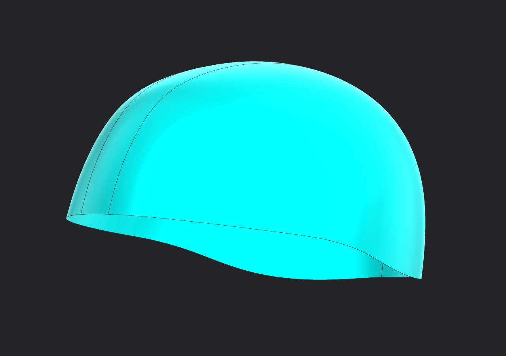
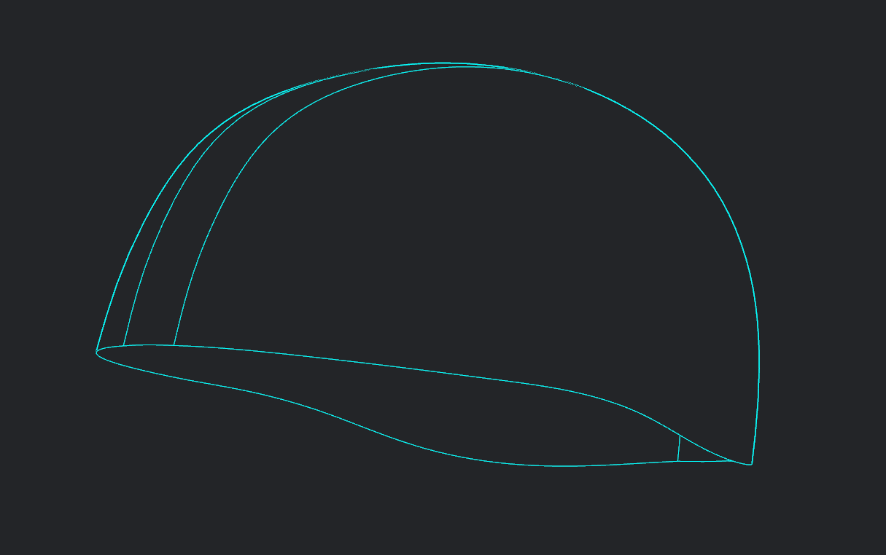
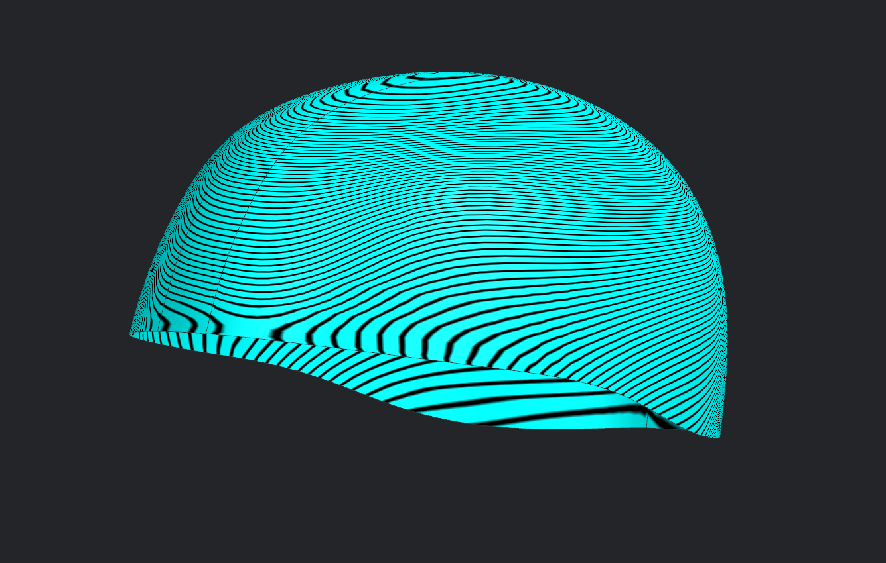

# Helmet 01 – Liner Surface

## Overview

This model represents the first surface modelling exercise completed during my industrial training at **Vega Auto Accessories Pvt. Ltd.**

The objective was to develop a smooth and manufacturable helmet liner surface from a legacy helmet reference model while following industry-standard surfacing practices in **Siemens NX**.

---

## Modelling Objective

- Develop a complete helmet liner surface.
- Maintain smooth transitions across adjacent surfaces.
- Preserve appropriate surface continuity throughout the model.
- Validate the final surface using surface quality analysis.

---

## Siemens NX Workflow

The liner surface was developed using a combination of advanced Siemens NX surfacing tools, including:

- Sketching using custom datum planes
- Spline Creation
- Through Curves
- Through Curve Mesh
- Studio Surface
- Bridge Curves
- Trim Sheet
- Split Body
- Delete Body
- Project Curves

Throughout the modelling process, **G0 (Position)** and **G1 (Tangency)** continuity were maintained wherever required to ensure smooth surface transitions.

---

## Surface Validation

The completed liner surface was evaluated using **Surface Analysis (Zebra Analysis)** to verify surface smoothness and continuity.

---

## Gallery

### Final Liner Surface

---

### Wireframe View

The wireframe illustrates the underlying surface layout, curve network, and patch boundaries used during surface construction.

---

### Zebra Analysis

Zebra Analysis was used to inspect surface continuity and verify smooth transitions across neighbouring surfaces.

---

## Skills Demonstrated

- Siemens NX Surface Modelling
- Helmet Liner Development
- Surface Continuity (G0 & G1)
- Surface Quality Validation
- Advanced Surface Construction

---

> **Note:** The original Siemens NX CAD model is not included as it is based on proprietary industrial training data from Vega Auto Accessories Pvt. Ltd. This repository focuses on demonstrating the surfacing methodology and representative visual results.
