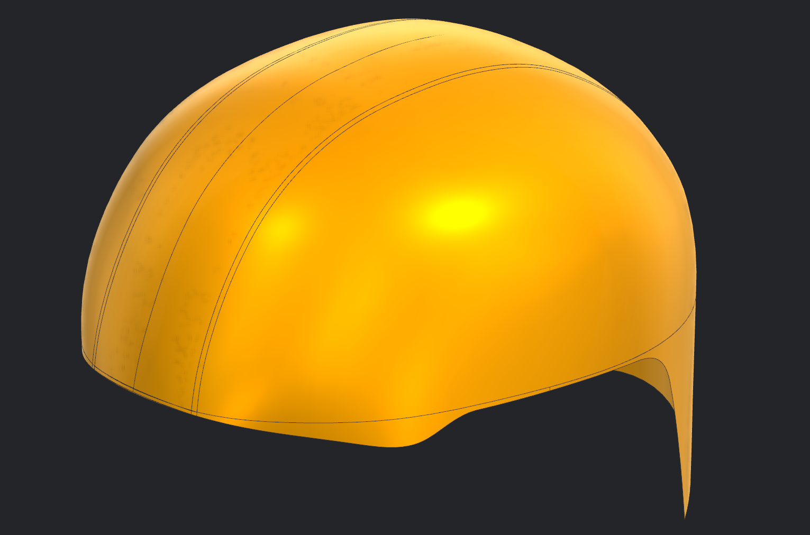
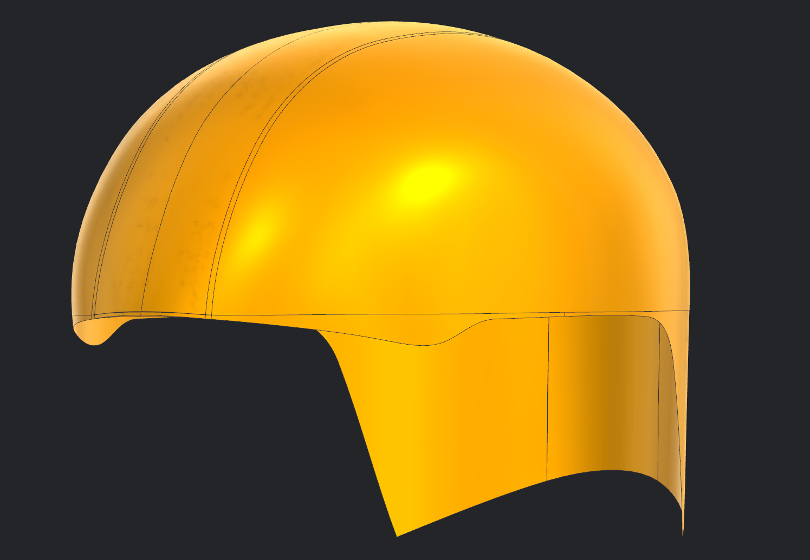
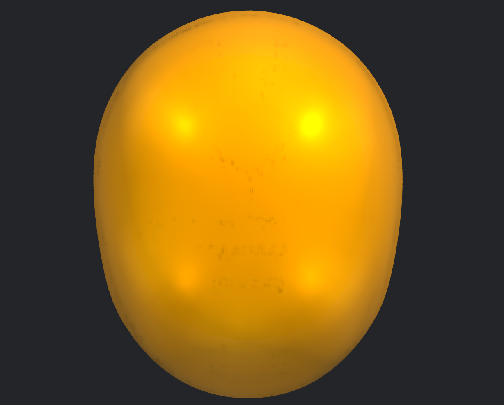
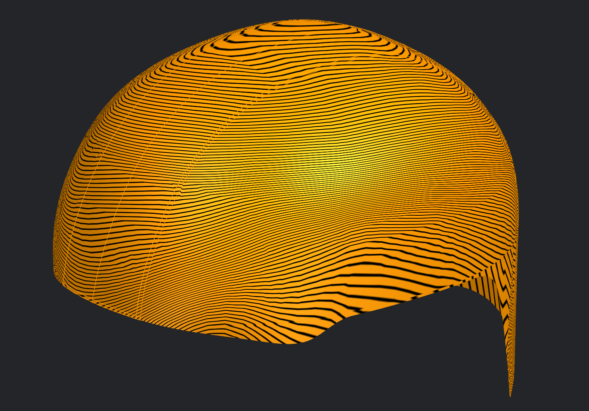
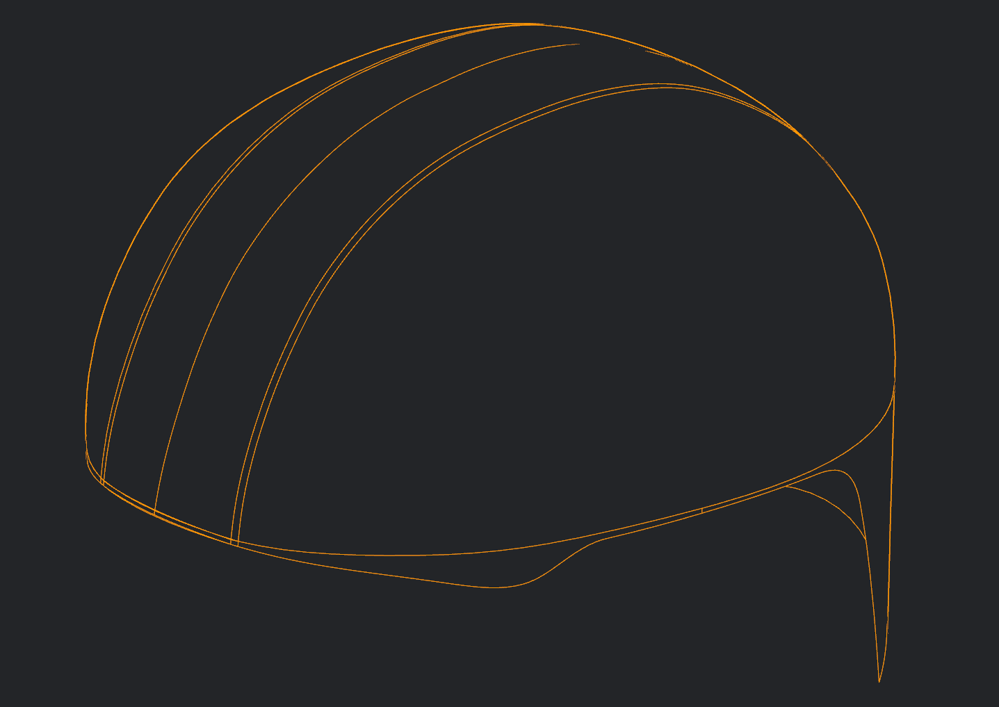

# Helmet 02 – Liner Surface

## Overview

This project focuses on developing the inner liner surface of a legacy helmet using Siemens NX advanced surfacing tools. Compared to Helmet 01, this model involved more complex freeform geometry and transition regions, requiring greater control over curve networks, surface continuity, and trimming operations.

The objective was to strengthen proficiency in production-oriented surface modeling workflows commonly used in industrial helmet design.

---

## Surface Development Workflow

- Constructed reference splines from helmet geometry
- Developed primary freeform surfaces using Through Curve and Through Curve Mesh
- Created complex transition regions using Studio Surface
- Generated smooth surface connections with Bridge Curves
- Built auxiliary datum planes and sketches for controlled surface creation
- Refined geometry using Trim Sheet, Split Body, and Delete Body
- Maintained G0 and G1 continuity throughout the model wherever required
- Evaluated final surface quality using Zebra Analysis

---

## Siemens NX Tools Used

- Spline
- Through Curve
- Through Curve Mesh
- Studio Surface
- Bridge Curve
- Trim Sheet
- Split Body
- Delete Body
- Project Curve
- Datum Plane
- Sketch
- Zebra Analysis

---

## Gallery

### Final Surface (Trimetric)

### Side View

### Top View

### Zebra Analysis

### Wireframe View

---

## Note

This model was developed as part of my surfacing training using a legacy helmet as the reference geometry. The objective was to further develop advanced freeform surface modeling skills while improving control over complex surface transitions, continuity management, and surface quality evaluation in Siemens NX.
