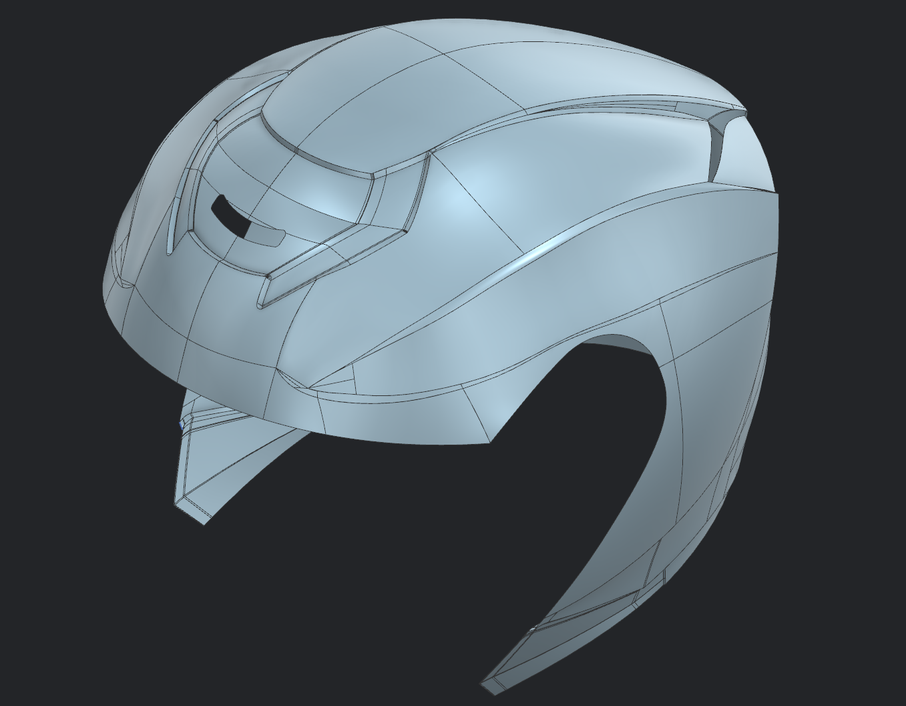
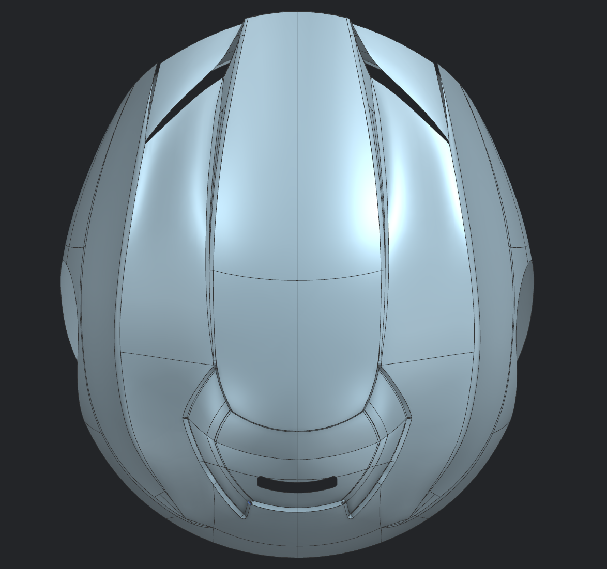
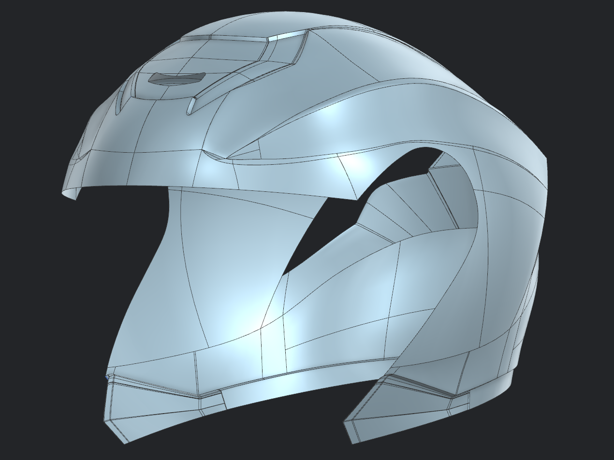
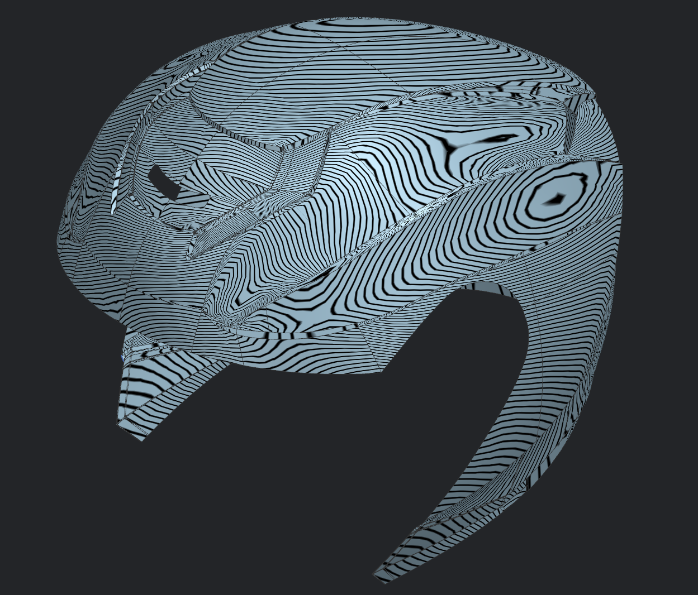
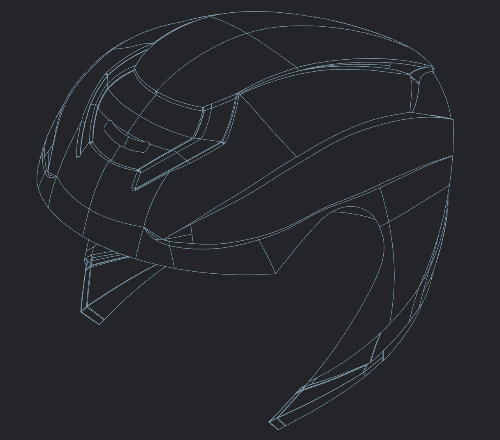

# Helmet 03 - Class A Surface

---

## Overview

This project focuses on developing the Class A exterior surface of a legacy motorcycle helmet using Siemens NX advanced surfacing tools. Compared to the previous liner surface models, this project introduced significantly more complex freeform geometry, sharp feature transitions, ventilation details, and multi-patch surface construction while maintaining high-quality surface continuity.

---

## Objectives

- Develop a complete Class A exterior surface from reference geometry
- Construct complex freeform surfaces with controlled transitions
- Maintain G0 and G1 continuity across adjoining surfaces
- Build detailed ventilation and styling features
- Validate overall surface quality using Zebra Analysis

---

## Tools Used

- Siemens NX
- Studio Surface
- Through Curves
- Through Curve Mesh
- Bridge Curve
- Spline
- Trim Sheet
- Split Body
- Sew
- Datum Plane
- Sketch
- Zebra Analysis

---

## Gallery

### Final Surface (Trimetric)

---

### Top View

---

### Side View

---

### Zebra Analysis

---

### Wireframe View

---

## Key Learning Outcomes

- Advanced Class A surfacing workflow in Siemens NX
- Construction and management of complex multi-patch surfaces
- Surface trimming, extension, and blending techniques
- Maintaining geometric continuity across styling features
- Surface quality validation using Zebra Analysis
- Improved understanding of industrial motorcycle helmet design workflows

---

## Note

This project was completed as part of my industrial surfacing practice and represents a progression from liner surface development to full Class A exterior surface modelling using Siemens NX.
