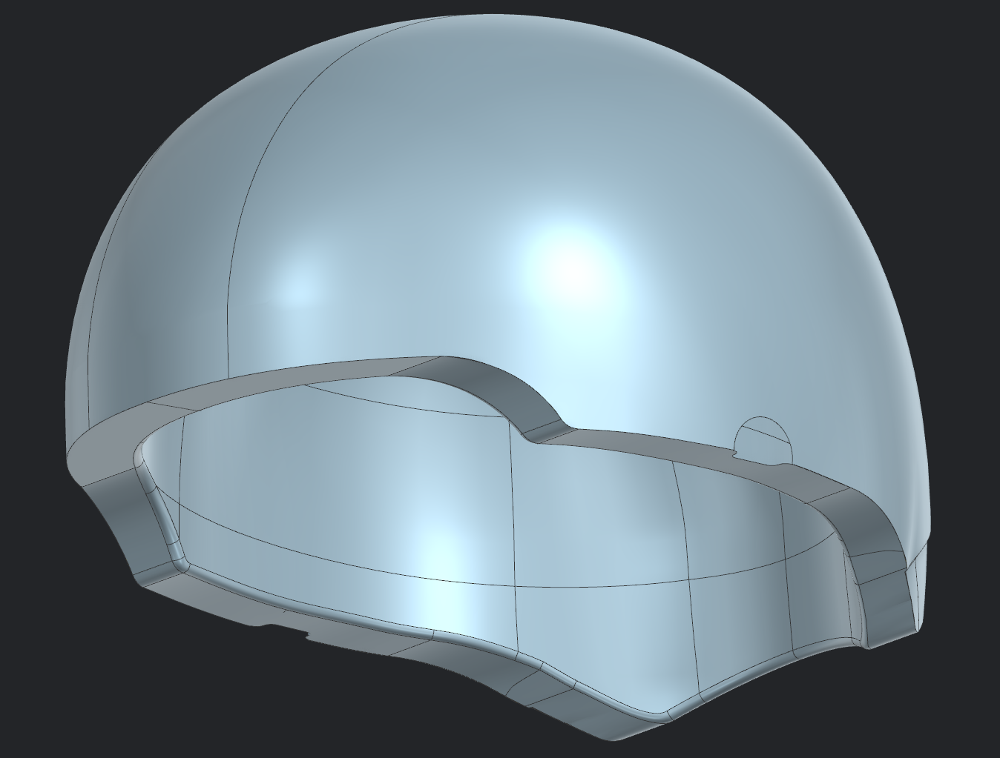
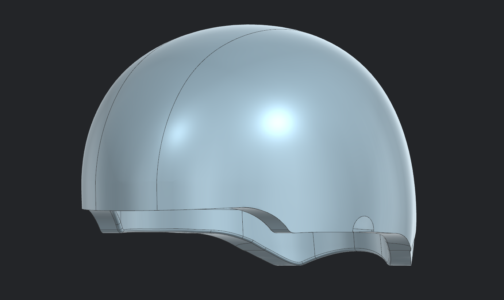
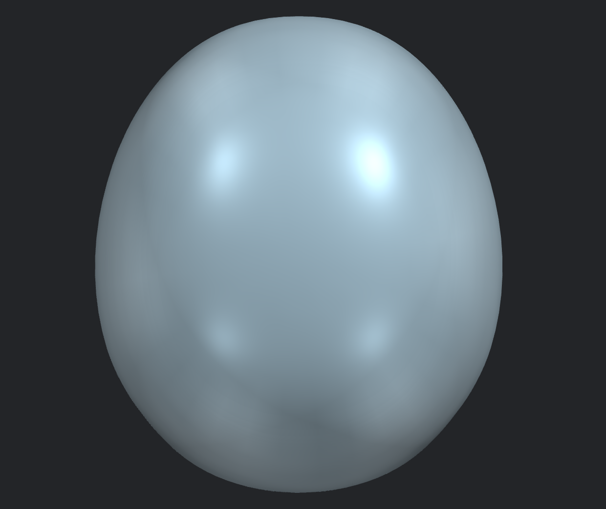
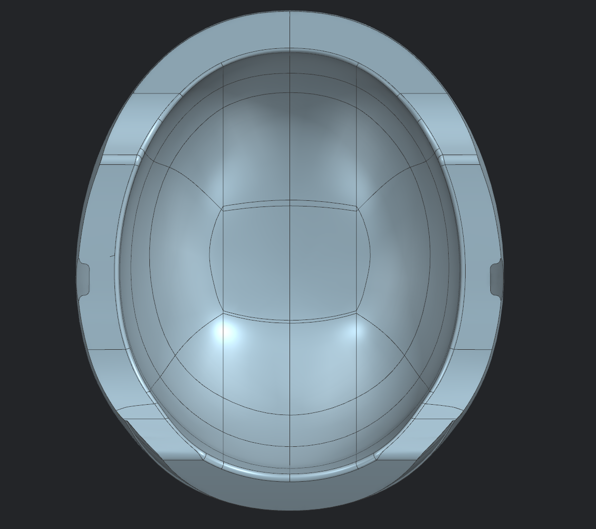

# Helmet 04 - Complete Helmet Surface

---

## Overview

This project focuses on developing a complete helmet surface in Siemens NX by modeling both the inner liner surface and the outer Class A surface before sewing them into a single continuous body. The objective was to build production-quality freeform surfaces while maintaining smooth transitions, accurate geometry, and clean surface continuity throughout the model.

This project represents a significant progression from the previous helmet models by combining multiple advanced surfacing workflows into a complete helmet assembly.

---

## Objectives

- Develop the inner liner surface
- Create the outer Class A surface
- Maintain smooth surface transitions throughout the model
- Sew all surfaces into a single continuous body
- Validate overall surface quality

---

## Tools Used

- Siemens NX
- Studio Surface
- Through Curves
- Through Curve Mesh
- Bridge Curve
- Spline
- Trim Sheet
- Sew
- Datum Plane
- Sketch
- Surface Analysis

---

## Gallery

### Complete Helmet (Trimetric)

---

### Side View

---

### Top View

---

### Bottom View

---

## Key Learning Outcomes

- Advanced freeform surface modeling
- Class A surface development
- Inner liner surface construction
- Surface sewing and body creation
- Surface continuity management
- Industrial surfacing workflow in Siemens NX

---

## Note

This project demonstrates the complete workflow of helmet surface development—from creating the inner liner and exterior Class A surfaces to sewing them into a single manufacturable body. It represents the culmination of the surfacing techniques practiced throughout the previous helmet modeling projects.
